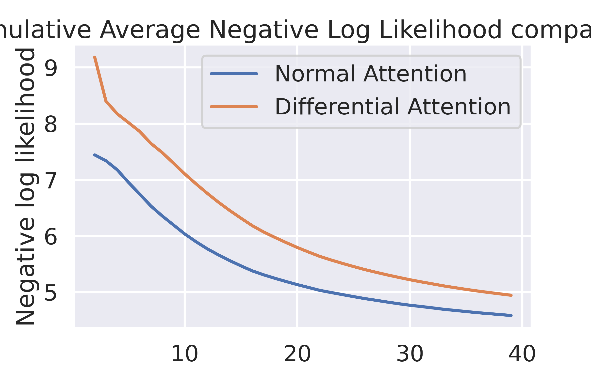

# Differential Transformer — Reimplementation & Study

[](https://www.python.org/)
[](https://pytorch.org/)
[](https://arxiv.org/abs/2410.05258)
[](https://dac.lip6.fr/)

A from-scratch reimplementation and empirical study of the **Differential Transformer** (Ye et al., 2024), carried out for the *Advanced Machine Learning (AMAL)* course of the **Master DAC / M2A** at **Sorbonne Université**.

We reimplement both a **classical Transformer** and a **Differential Transformer** in PyTorch, train two small language models on WikiText under identical conditions, and compare them on standard language-understanding benchmarks and on a long-context negative-log-likelihood analysis.

> **Authors:** Tiziano Fassina · Martín Gómez Abejón · Pablo Soto Martín
> **Reference paper:** T. Ye, L. Dong, Y. Xia, Y. Sun, Y. Zhu, G. Huang, F. Wei — *Differential Transformer* — [arXiv:2410.05258](https://arxiv.org/abs/2410.05258)

---

## Table of Contents

- [Overview](#overview)
- [The Differential Attention Mechanism](#the-differential-attention-mechanism)
- [Key Features](#key-features)
- [Repository Structure](#repository-structure)
- [Installation](#installation)
- [Usage](#usage)
- [Experimental Setup](#experimental-setup)
- [Results](#results)
- [Limitations](#limitations)
- [Authors](#authors)
- [Citation](#citation)
- [License & Acknowledgements](#license--acknowledgements)

---

## Overview

Since *Attention Is All You Need* (Vaswani et al., 2017), the Transformer has become the de-facto architecture for sequence modeling. Its core mechanism — softmax attention — is powerful but tends to **over-allocate attention to irrelevant context**, an effect the reference paper calls *attention noise*. This noise can drown out the signal from the tokens that actually matter.

The **Differential Transformer** addresses this by replacing standard attention with **differential attention**: it computes *two* separate softmax attention maps and takes their (learnably weighted) difference. Much like noise-cancelling headphones or a differential amplifier, subtracting two correlated signals cancels the common-mode noise while preserving the useful signal, encouraging sparser and more focused attention patterns.

This project reproduces that idea at small scale. We build both architectures from the same components, train them side by side, and measure whether the differential mechanism yields a measurable advantage in our compute-constrained setting.

## The Differential Attention Mechanism

Given an input sequence $X$, queries and keys are projected and **split into two groups**, and value vectors are projected as usual:

$$[Q_1; Q_2] = X W^Q, \qquad [K_1; K_2] = X W^K, \qquad V = X W^V$$

Differential attention is then defined as the difference of two softmax maps:

$$\mathrm{DiffAttn}(X) = \left( \mathrm{softmax}\!\left(\frac{Q_1 K_1^\top}{\sqrt{d}}\right) - \lambda \, \mathrm{softmax}\!\left(\frac{Q_2 K_2^\top}{\sqrt{d}}\right) \right) V$$

where $\lambda$ is a **learnable scalar** (one per head). To stabilize training it is re-parameterized as a difference of exponentials plus a constant initializer:

$$\lambda = \exp(\lambda_{q_1} \cdot \lambda_{k_1}) - \exp(\lambda_{q_2} \cdot \lambda_{k_2}) + \lambda_{\text{init}}$$

Following the paper, our implementation keeps the surrounding macro-architecture close to a LLaMA-style Transformer:

- **Pre-norm** residual blocks using **RMSNorm** (`normalization.py`).
- A **GroupNorm** applied to the concatenated heads and scaled by $(1 - \lambda_{\text{init}})$ to keep gradient statistics comparable to standard attention (`normalization.py`).
- **SwiGLU** feed-forward layers with an $8/3$ hidden expansion (`swiglu.py`).
- **Causal masking** for autoregressive language modeling.

The classical `Transformer` and the `DifferentialTransformer` share everything except the attention module, so any difference in performance is attributable to differential attention alone.

## Key Features

- **Two attention mechanisms from scratch** — classical multi-head causal attention and differential attention — behind a single, swappable interface (`model.py`).
- **Two language-model heads** — one with a fully trainable embedding table, and one that reuses **frozen pretrained RoBERTa** input/output embeddings (`language_model.py`).
- **Reproducible training pipelines** on WikiText, with TensorBoard logging (`wiki_training.py`, `wiki_training_roberta.py`).
- **Standardized benchmarking** through the [EleutherAI LM Evaluation Harness](https://github.com/EleutherAI/lm-evaluation-harness) (`evaluation.py`).
- **Long-context analysis** of cumulative negative log-likelihood vs. token position (`context_eval.py`).
- **Interactive demo** — a Gradio text-completion interface for the trained differential model (`interface.py`).

## Repository Structure

| Path | Description |
| --- | --- |
| `model.py` | Core architectures: `Attention`, `DifferentialAttention`, and the `Transformer` / `DifferentialTransformer` stacks. |
| `normalization.py` | `RMSNorm` and the paper-specific `GroupNorm` (scaled by $1-\lambda_{\text{init}}$). |
| `swiglu.py` | `Swish` activation and the `SwiGLU` feed-forward block. |
| `language_model.py` | Two LM wrappers: `LanguageModel` (trainable embeddings) and `LanguageModel_PretrainedEmb` (frozen RoBERTa embeddings), each with greedy `generate`. |
| `wiki_training.py` | Trains both models with trainable embeddings on **WikiText-2-raw-v1**. |
| `wiki_training_roberta.py` | Trains both models with frozen RoBERTa embeddings on **WikiText-103-raw-v1**. |
| `evaluation.py` | Wraps the models in the LM Evaluation Harness API and runs the benchmark suite. |
| `context_eval.py` | Computes and plots cumulative average NLL over token position (long-context test). |
| `interface.py` | Gradio web interface for interactive text generation. |
| `models/hyper.json`, `models/hyper_roberta.json` | Hyperparameter configurations for the two training regimes. |
| `results/` | Benchmark outputs (JSON) for both models, zero-shot and 5-shot. |
| `cumulative_NLL.png` | Long-context NLL comparison plot produced by `context_eval.py`. |
| `requirements.txt` | Pinned Python dependencies. |

## Installation

Requires **Python 3.11+** and (recommended) a CUDA-capable GPU; Apple Silicon (MPS) and CPU are also supported and selected automatically.

```bash
# 1. Clone
git clone https://github.com/psotom/AMAL.git
cd AMAL

# 2. (Recommended) create a virtual environment
python -m venv .venv && source .venv/bin/activate

# 3. Install dependencies
pip install -r requirements.txt

# 4. Benchmarking additionally requires the LM Evaluation Harness
pip install lm-eval
```

> **Note.** Trained weights (`models/*.pth`) are **not** shipped with the repository (they are excluded via `.gitignore`). Run one of the training scripts first to produce them; `evaluation.py`, `context_eval.py`, and `interface.py` expect the RoBERTa-embedding checkpoints in `models/`.

## Usage

### Train

```bash
# Trainable embeddings on WikiText-2
python wiki_training.py

# Frozen pretrained RoBERTa embeddings on WikiText-103
python wiki_training_roberta.py
```

Both scripts train the classical and differential models in parallel, log losses to `outputs/` (viewable with `tensorboard --logdir outputs`), and save checkpoints to `models/`.

### Evaluate on benchmarks

```bash
python evaluation.py
```

Runs the harness over PIQA, BoolQ, WinoGrande, ARC-Easy, ARC-Challenge, and OpenBookQA, and writes per-task metrics to `results/`. Edit `num_fewshot` in the script to switch between zero-shot and few-shot settings.

### Long-context analysis

```bash
python context_eval.py
```

Produces `cumulative_NLL.png`, comparing the two models' cumulative average NLL as a function of token position.

### Interactive demo

```bash
python interface.py
```

Launches a local Gradio app where you can type a prompt and watch the trained Differential Transformer complete it.

## Experimental Setup

Because the original 3B-parameter model trained on 1T tokens is far beyond our budget, we study the mechanism at a small, controlled scale.

| Setting | Value |
| --- | --- |
| Datasets | WikiText-2-raw-v1 (trainable emb.) · WikiText-103-raw-v1 (RoBERTa emb.) |
| Tokenizer / embeddings | RoBERTa-base tokenizer with **frozen** pretrained RoBERTa embeddings |
| Layers | 10 stacked (differential) Transformer blocks |
| Attention heads / head dim | 4 / 32 |
| Hidden dimension | 128 |
| Sequence length | 40 |
| $\lambda_{\text{init}}$ | 0.75 (RoBERTa regime) / 0.5 (trainable-embedding regime) |
| Optimizer | AdamW, lr $5\times10^{-4}$ (RoBERTa) / Adam, lr $10^{-3}$ |
| Hardware | Local NVIDIA GPU workstation + RTX 4090D rented on Vast.ai |
| Compute | ~2 h/epoch; ≈30 epochs, ≈120 GPU-hours total for both models |

Benchmarks are run with the EleutherAI **LM Evaluation Harness** in both zero-shot and 5-shot settings.

## Results

### Language-understanding benchmarks (accuracy)

The two architectures reach **comparable accuracy** across the suite; neither dominates the other in this small-scale regime. Best value per row is shown in **bold**.

**Zero-shot**

| Model | ARC-C | ARC-E | BoolQ | OBQA | PIQA | WinoGrande | Avg. |
| --- | :---: | :---: | :---: | :---: | :---: | :---: | :---: |
| Transformer | **0.222** | **0.287** | 0.378 | **0.148** | 0.538 | 0.496 | **0.345** |
| Differential | 0.215 | **0.287** | 0.378 | 0.114 | **0.539** | **0.507** | 0.340 |

**5-shot**

| Model | ARC-C | ARC-E | BoolQ | OBQA | PIQA | WinoGrande | Avg. |
| --- | :---: | :---: | :---: | :---: | :---: | :---: | :---: |
| Transformer | 0.217 | **0.271** | 0.378 | **0.142** | 0.526 | **0.508** | **0.340** |
| Differential | **0.224** | 0.259 | 0.378 | 0.134 | **0.539** | 0.493 | 0.338 |

<sub>Metric: accuracy (`acc`) from the LM Evaluation Harness. Raw per-task JSON is in `results/`. At this scale the models perform near the tasks' baselines, so differences are within noise.</sub>

### Long-context negative log-likelihood

We measure the cumulative average NLL over token position on the WikiText-2 test set (window up to the 40-token context length).



In the reference paper, differential attention is *more* effective at exploiting longer contexts. In our under-trained, small-scale setting we observe the **opposite** trend — the classical model achieves slightly lower NLL — which we attribute to the limitations discussed below rather than to the mechanism itself.

## Limitations

- **Scale.** Our models are orders of magnitude smaller than the reference (10 layers, hidden dim 128, 40-token context vs. a 3B-parameter, long-context model), so the advantages the paper reports — most of which emerge with scale in model size, training tokens, and context length — are not expected to fully materialize here.
- **Convergence.** Under our compute budget the models did not reach full convergence, which caps generation quality and downstream scores and likely explains the long-context result reversal.
- **Context length.** A 40-token window limits how much a *long-context* benefit can even be observed.
- **Evaluation coverage.** The harness wrapper evaluates in ≤40-token windows; some tasks (e.g. BoolQ) sit at their trivial baseline for both models.

Taken together, these results should be read as a **faithful reproduction of the mechanism** and a study of its behavior under tight constraints, not as a scaled benchmark of the paper's headline claims.

## Authors

- **Tiziano Fassina**
- **Martín Gómez Abejón**
- **Pablo Soto Martín**

Advanced Machine Learning (AMAL) — Master DAC / M2A, Sorbonne Université.

## Citation

If you refer to the original method, please cite the paper this project reproduces:

```bibtex
@article{ye2024differential,
  title   = {Differential Transformer},
  author  = {Ye, Tianzhu and Dong, Li and Xia, Yuqing and Sun, Yutao and
             Zhu, Yi and Huang, Gao and Wei, Furu},
  journal = {arXiv preprint arXiv:2410.05258},
  year    = {2024}
}
```

## License & Acknowledgements

This repository is an academic project released for **educational purposes**. The Differential Transformer architecture is the work of Ye et al. (2024); this codebase is an independent reimplementation. Built with [PyTorch](https://pytorch.org/), [Hugging Face Transformers & Datasets](https://huggingface.co/), the [EleutherAI LM Evaluation Harness](https://github.com/EleutherAI/lm-evaluation-harness), and [Gradio](https://www.gradio.app/).

## Links

- **GitHub repository:** [github.com/psotom/AMAL](https://github.com/psotom/AMAL.git)
- **Original paper:** [arXiv:2410.05258](https://arxiv.org/abs/2410.05258)
